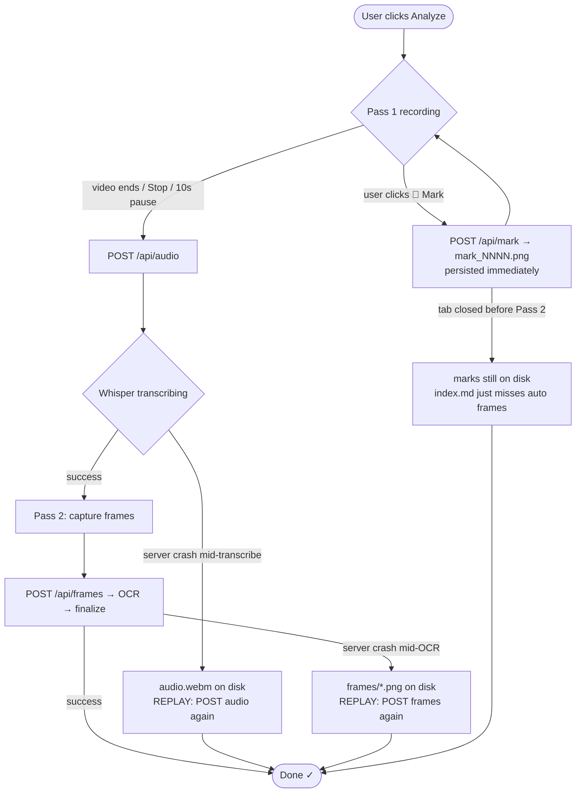

# video2project — Architecture

**Version:** v1  ·  **Last change:** 2026-07-28 — added sha256-based idempotency in `ingest_audio` + `video2project resume` CLI.

Before rewriting this file for a significant architecture change, snapshot the current version as `ARCHITECTURE-v<N>.md` so the design history stays comparable.

---

## System at a glance

Two independent flows share the same local Python server:

- **Legacy flow** (still on `master`): `yt-dlp` pulls video + captions from YouTube directly. Fast when it works; dies on YouTube's bot wall (geo/proxy-independent).
- **Browser-capture flow** (this branch, primary going forward): a Chrome extension records audio + captures frames from the tab your user is already watching, then POSTs them to the local server. No `yt-dlp`, no bot wall.

The rest of this doc is the browser-capture flow.

---

## The happy path

```mermaid
sequenceDiagram
    autonumber
    participant U as User
    participant EX as Chrome extension<br/>(content.js on YouTube tab)
    participant V as <video> element<br/>(YouTube's player)
    participant S as localhost:8765<br/>ingest_server.py
    participant W as Whisper (medium)
    participant O as PaddleOCR
    participant F as finalize.py

    U->>EX: Click "Analyze this video"
    Note over EX,V: Pass 1 — audio (real-time)
    EX->>V: video.captureStream()
    V-->>EX: MediaStream (live audio)
    EX->>EX: MediaRecorder → audio.webm (in-memory)
    U->>EX: watches video / clicks 📌 Mark N times
    loop for each mark click
        EX->>V: canvas.drawImage(video) at currentTime
        EX->>S: POST /api/mark {ts, image_b64}
        S->>S: save frames/mark_NNNN.png<br/>+ append pending_marks.json
        S-->>EX: {total_marks: N}
    end
    U->>EX: video ends / user clicks Stop / 10s pause
    EX->>S: POST /api/audio {audio_b64, metadata}
    S->>W: transcribe_audio(audio.webm)
    W-->>S: segments + language
    S->>S: _pick_candidate_timestamps() → [t1...tN]
    S-->>EX: {timestamps: [...]}

    Note over EX,V: Pass 2 — auto-selected frames
    loop each timestamp
        EX->>V: video.currentTime = t; drawImage()
    end
    EX->>S: POST /api/frames {frames: [...], metadata}
    S->>S: save frames/frame_NNNN.png<br/>merge pending_marks (dedupe 0.1s)
    S->>O: ocr_frames(all_pngs)
    O-->>S: per-frame {text, confidence, needs_human}
    S->>F: finalize(video_dir)
    F-->>S: index.md + index.json
    S-->>EX: {n_frames, n_needs_human, index_md}
    EX-->>U: "Done ✓  N frames, X need human check"
```

---

## Files & responsibilities

| Layer | File | Job |
|---|---|---|
| **Browser** | `extension/manifest.json` | MV3 config, permissions, content-script match on `youtube.com/watch*` |
| | `extension/content.js` | Runs on YouTube page. Owns `<video>`, Pass 1 recorder, Pass 2 seeker, mark POST, stop button. |
| | `extension/popup.html` + `popup.js` | Toolbar UI. Polls `chrome.storage.local` for state (survives popup close). |
| | `extension/background.js` | Service worker. Fires `v2p-run` to content script; fire-and-forget so long capture doesn't hit "channel closed" errors. |
| **Server** | `src/video2project/ingest_server.py` | Stdlib `ThreadingTCPServer` on :8765. Routes: `/api/health`, `/api/start`, `/api/audio`, `/api/frames`, `/api/mark`. |
| | `src/video2project/capture.py` | HTTP-endpoint logic. `start_job`, `ingest_audio` (**sha256-idempotent**), `ingest_frames`, `ingest_mark` (persist-on-click). |
| | `src/video2project/transcribe.py` | Whisper wrapper. Auto-language, VAD off (music/quiet-speech safe). |
| | `src/video2project/ocr.py` | PaddleOCR 3.x wrapper. Confidence < 0.85 → `needs_human=True`. |
| | `src/video2project/finalize.py` | Writes `index.md` + `index.json`; tolerates missing frames/claims. |
| | `src/video2project/review.py` | Separate review server (different port) — QA UI for finished videos. |

---

## Data on disk

Per-video artifact directory: `~/Documents/video2project/videos/youtube__<VIDEO_ID>/`

```
capture_metadata.json     ← written by /api/start
audio.webm                ← written by /api/audio (Pass 1 upload)
transcript.json           ← Whisper output + `audio_sha256` for cache lookup
pending_marks.json        ← accumulates per /api/mark click (persist-on-click)
frames/
  mark_0001.png           ← from mark clicks (index N in pending_marks)
  mark_0002.png
  frame_0001.png          ← from auto-selected timestamps (Pass 2)
  frame_0002.png
  ...
candidates.json           ← merged {auto + manual}, deduped by 0.1s, with OCR
ocr_results.json          ← raw OCR output
claims.json               ← LLM output (empty [] until claim-extraction stage)
index.md, index.json      ← the deliverable
state.json                ← per-stage completion timestamps
run.log
```

### CLI escape hatches

- **`video2project resume <video_id>`** — reads `audio.webm` off disk and re-invokes `ingest_audio` in-process. Cache hit (same sha256) returns in ~1s; miss re-transcribes. Use when the extension can't complete Pass 2 (crash, tab closed, WSL shutdown).

---

## Recovery paths (what happens if X dies)



**Key invariant:** every state transition writes to disk *before* returning success. A crash between HTTP handler and next call never loses data — just replay the last endpoint.

---

## Non-obvious decisions

- **`SO_REUSEADDR` before bind, not after.** `ThreadingTCPServer` binds in `__init__`; setting `allow_reuse_address = True` on the instance is too late. Fixed by subclassing with the class attr.
- **`vad_filter=False`** on Whisper — VAD silently drops music/quiet speech (0 segments on songs). Better to feed everything through.
- **Auto-language, not hard `zh`.** A hard `zh` hint returns 0 segments on non-Chinese audio. `V2P_WHISPER_LANGUAGE=zh` still overrides when you know.
- **PaddlePaddle pinned to `3.2.2`.** 3.3.1 has a OneDNN/PIR crash (`ConvertPirAttribute2RuntimeAttribute`) on this CPU. No env flag fixes it.
- **Fire-and-forget message channel.** Popup gets `{started: true}` in <1s and closes safely; capture continues in content script; state flows through `chrome.storage.local`. Fixed "async listener returned true, channel closed" error.
- **Marks POST immediately, not batched.** A crash mid-run used to lose all marks; now each click is one atomic disk write.
- **`ingest_audio` is idempotent by sha256.** Transcript.json stores `audio_sha256`; re-POSTing the same audio returns cached timestamps in ~1s instead of re-running Whisper. Enables `video2project resume <video_id>` for crash recovery.

---

## Known scars (not yet fixed, keep in mind)

- **`POST /api/audio` blocks for the full transcription time** on a cold call (~1× real-time). Idempotent cache makes the second call ~1s, so a crash-then-`resume` is cheap. A cold-cache WSL shutdown still kills the run — do the deferred async refactor only if this bites ≥2× a week. Not fixing preemptively.
- **`master` still has the legacy yt-dlp flow.** Not merged with browser-capture; pick one branch per project.

---

## Versioning this doc

- **Small updates** (bug fixes, new endpoint, one-line clarifications): edit in place, bump the "Last major change" line at top.
- **Big changes** (adding async transcription, moving to WebSockets, second capture pass, etc.): before rewriting, `cp docs/ARCHITECTURE.md docs/ARCHITECTURE-v<N>.md`. Version bumps ideally align with a git tag so diffs are recoverable.
